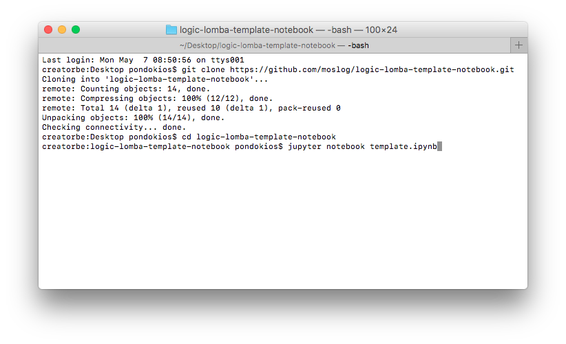
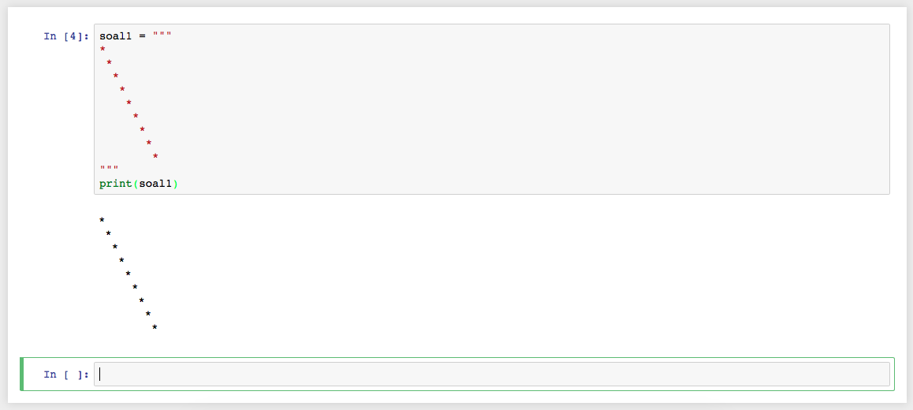

# Template Lomba Logic
### Template untuk lomba mengerjakan soal logic Pondok Programmer

Unduh template dengan menggunakan perintah `git clone https://github.com/moslog/logic-lomba-template-notebook.git` di terminal.

Mengunduh git dengan tutorial [Getting Started Installing Git](https://git-scm.com/book/en/v2/Getting-Started-Installing-Git)

Masuk folder `logic-lomba-tempat-notebook` dan buka file notebook dengan perintah `jupyter notebook template.ipynb`

Atau salin dan tempel perintah ini ke terminal:

**Shortcut**

**Mac & Linux**
```shell
cd ~/Desktop
dir_name=LogicLombaTemplate
rm -rf $dir_name
mkdir $dir_name
cd $dir_name
wget https://raw.githubusercontent.com/moslog/logic-lomba-template-notebook/master/template.ipynb
jupyter notebook
```

**Windows Powershell**
```powershell
cd ~\Desktop
$dir_name = "LogicLombaTemplate"
rm -rf $dir_name
mkdir $dir_name
cd $dir_name
$url = "https://raw.githubusercontent.com/moslog/logic-lomba-template-notebook/master/template.ipynb"
wget $url -Outfile template.ipynb
```
**Git Clone**
```shell
git clone https://github.com/moslog/logic-lomba-template-notebook.git
cd logic-lomba-template-notebook
jupyter notebook template.ipynb
```

**cURL**
```shell
curl -O https://raw.githubusercontent.com/moslog/logic-lomba-template-notebook/master/template.ipynb
jupyter notebook template.ipynb
```


**Screenshoot**




### Contoh Pengerjaaan:

**Logic 1 Soal 1**

_Python_
   ```python
   soal1 = """
   *
    *
     *
      *
       *
        *
         *
          *
           *
   """
   print(soal1)
   ```
   
   **Notebook**
    

